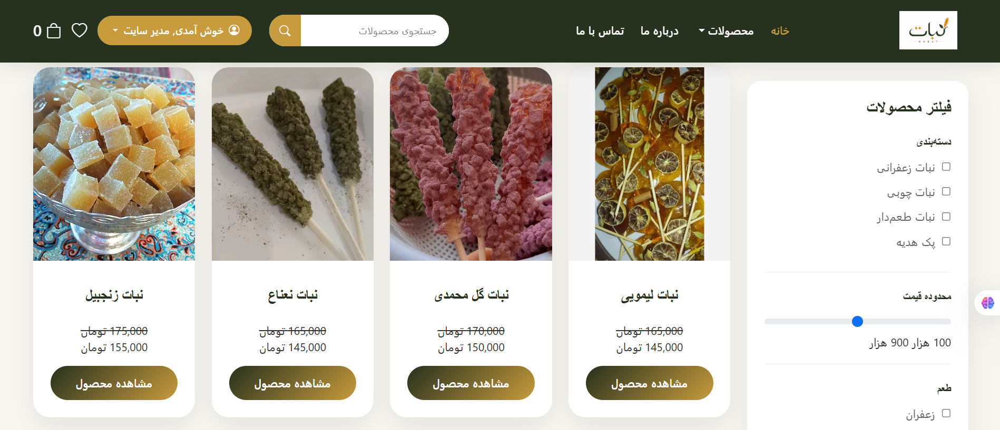
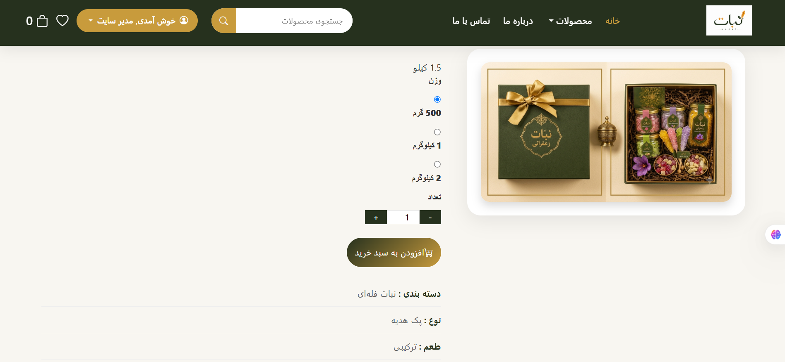
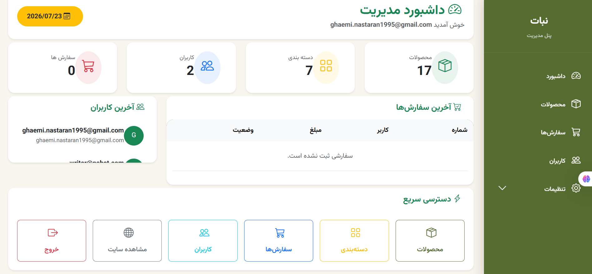
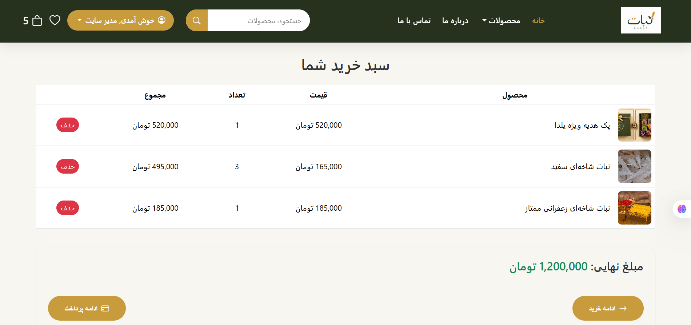
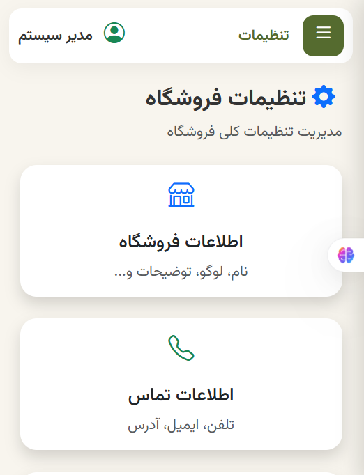

# 🌿 Nabat Online Shop

A modern e-commerce web application built with **ASP.NET Core MVC**.
This project was developed as a portfolio project to demonstrate backend development skills, clean architecture principles, and full-stack web development with the .NET ecosystem.

---

## 🚀 Features

* User Authentication & Authorization
* Product Management
* Category Management
* Shopping Cart
* Checkout Process
* Order Management
* Admin Dashboard
* Site Settings Management
* Contact Information Management
* SEO Settings
* Social Media Settings
* Shipping Settings
* Payment Settings
* Responsive UI (RTL)

---

## 🛠 Technologies

* ASP.NET Core MVC
* C#
* Entity Framework Core
* SQL Server
* ASP.NET Identity
* Razor Views
* Bootstrap 5 RTL
* HTML5
* CSS3
* JavaScript

---

## 📂 Project Structure

```text
Areas/
Controllers/
Data/
Migrations/
Models/
ViewComponents/
ViewModels/
Views/
wwwroot/
```

---
## 📸 Screenshots

### Home Page


### Shop



### Product Details



### Shopping Cart


### Checkout


### Admin Dashboard



### Product Management


### Mobile 


### About Mobile

---

## 🔧 Getting Started

### Clone the repository

```bash
git clone https://github.com/nasi1995/OnlineShop.git
```

### Open the project

```bash
cd OnlineShop
```

### Restore packages

```bash
dotnet restore
```

### Update the database

```bash
dotnet ef database update
```

### Run the project

```bash
dotnet run
```

---

## 📌 Future Improvements

* Product Search
* Product Reviews
* Wishlist
* Online Payment Gateway
* Discount Coupons
* Dashboard Charts
* Multi-language Support

---

## 👩‍💻 Author

**Nastaran Ghaemi**

GitHub:
https://github.com/nasi1995

---

⭐ If you like this project, consider giving it a star.
